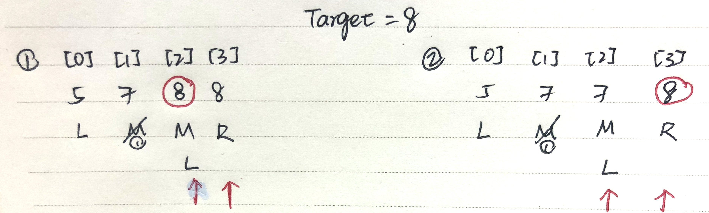
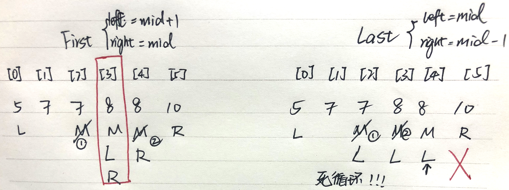
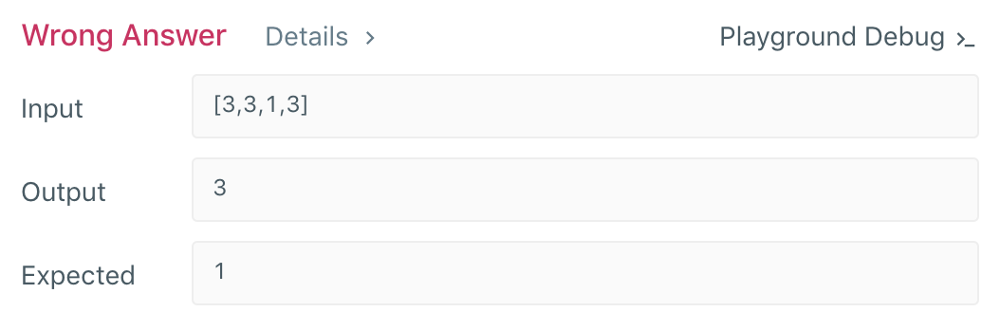
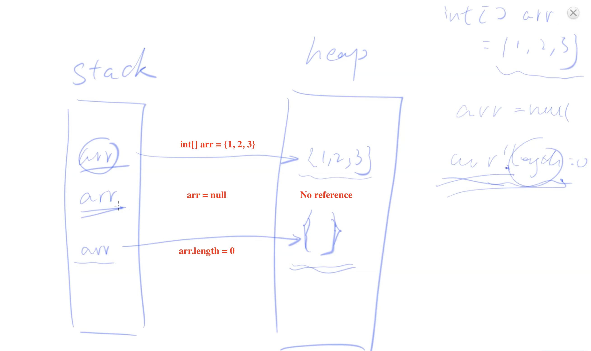
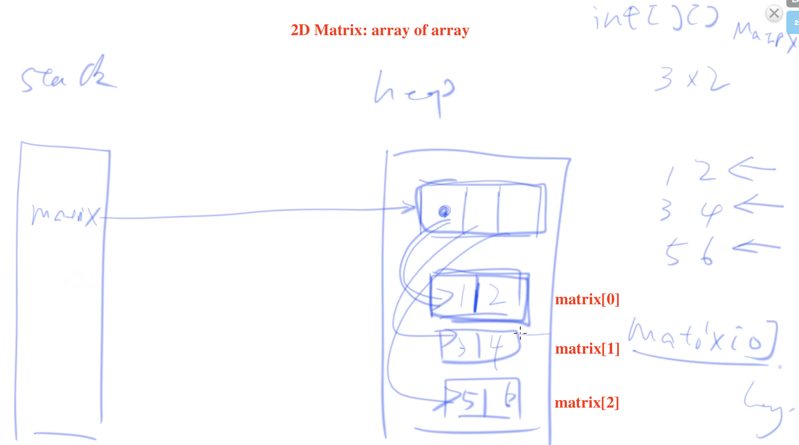
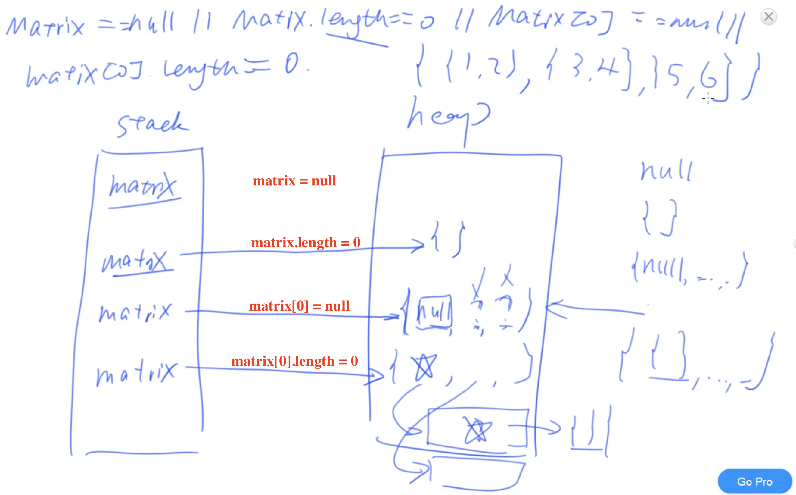

# Session 1: Binary Search (Tree) & Binary Reduction

---

## I. Introduction Questions

---

- **做Binary Search的对象一定要是Sorted么? 如果没有sorted, 那么具有什么特性可以做Binary Search?**

    不一定。广义的Binary search可以用来做一切区分true/false、黑与白、冰与火的分界线。

    Example: 找波峰/波谷，找连续的true/false的分界线

- **做Binary Search的数据结构一定要是Array? 如果是，是否Array里面存储对象一定要是int呢？**

    不一定。可以是BST，可以是任何implement **comparable/comparater interface**的class ⇒ 可以做sorting ⇒ 可以做binary search. 

    如果是Array可以是char[] ⇒ 根据ASCII, 可以是String[] ⇒ 根据字典的顺序

- **不是数据结构，广义的API是否能做Binary Search?**

    也可以. e.g, getVal(index)

## II. Binary Search 性质

---

- Binary Search的本质：一次把搜索问题的size减半
- Reduce half of current size → binary search tree
- 和 BST的关系：压扁后的BST
- 根据写法，需要做相应的
    1. pre-processing
    2. while(classical binary search)
    3. post-processing

# III. Questions

---

## Q1: L278 First Bad Version

---

[First Bad Version - LeetCode](https://leetcode.com/problems/first-bad-version/)

**Question:**  *找出分界线 1 1 1 1 1 0 0 0 0 0 0 0 0 0*

*You are given an API bool isBadVersion(version) which will return whether version is bad. Implement a function to find the first bad version. You should minimize the number of calls to the API.*

- Clarification of question
    - Corner case, return?
- Brute force: linear scan - for loop ⇒ O(n)
- Binary search ⇒ O(logn)

    /* The isBadVersion API is defined in the parent class VersionControl.
          boolean isBadVersion(int version); */
    
    public class Solution extends VersionControl {
        public int firstBadVersion(int n) {
            // Corner case 
            if(n <= 0) return -1;
            if(n == 1) return 1;
            
            int left = 1;
            int right = n;
            int mid;
            
            while (left + 1 < right){
                mid = left + (right - left) / 2;
                // When mid is bad AND the element before it is good, then mid is the first bad element
                if(isBadVersion(mid) && !isBadVersion(mid-1)) return mid;
                // When mid is good, move left pointer to mid
                if(!isBadVersion(mid)) left = mid;
                // When mid is bad, move right pointer to mid
                if(isBadVersion(mid)) right = mid;
            }
            
            // Post-processing
            if(!isBadVersion(left) && isBadVersion(right)) return right;
            if(isBadVersion(left) && isBadVersion(right)) return 1;
            if(!isBadVersion(left) && !isBadVersion(right)) return 0;  
            return 0;
        }
        
    }

**解题思路：**

- 将左右指针都逼近移到第一个Bad Version ← ***right = mid, left = mid + 1***
- 当左右指针重叠在第一个Bad Version时，跳出loop ← ***while (left < right)***

    public int firstBadVersion(int n) {
        int left = 1;
        int right = n;
    
    // 因为这道题在找分界线，所以不用考虑left = right的case
        while (left < right) {
            int mid = left + (right - left) / 2;
    
    				// When mid is bad, move right pointer to mid 
            if (isBadVersion(mid)) {
                right = mid;
            } 
    				// When mid is good, move left pointer to mid + 1
    				// There could only be two cases
    				// 1. G G G G B B B B    <- mid is in the middle of good 
    							l   m     r
    				// 2. G G G G B B B B    <- mid is last good => left moves to first bad 
    							l     m   r
    				else {
                left = mid + 1;
            }
        }
    		// 在所有情况下，最后left pointer和right pointer重叠在first bad version
        return left; // return right;
    }

## Q2: L374 Guess Number

---

[Guess Number Higher or Lower - LeetCode](https://leetcode.com/problems/guess-number-higher-or-lower/)

*You call a pre-defined API `guess(int num)` which returns 3 possible results (`-1`, `1`, or `0`):*

    -1 : My number is lower
     1 : My number is higher
     0 : Congrats! You got it!

- Brute force: guess from 1 to n ⇒ O(n)
- Binary search ⇒ O(logn)

**解题思路：**

- 需要考虑所有element，只需要找出正确的element而不是分界线 ⇒ ***while (left ≤ right)***
- 因为我们每次首先先判断了mid是否为正确值，我们可以不再考虑mid ⇒ ***right = mid - 1, left = mid + 1***

    /* The guess API is defined in the parent class GuessGame.
       @param num, your guess
       @return -1 if my number is lower, 1 if my number is higher, otherwise return 0
          int guess(int num); */
    
    public class Solution extends GuessGame {
        public int guessNumber(int n) {
            int left = 1;
            int right = n;
            int mid;
         
            while(left <= right){
                mid = left + (right - left) / 2;
                if(guess(mid) == 0) return mid;
    						// When correct number is lower, move right pointer to be lower 
                else if(guess(mid) == -1) right = mid - 1;
    						// When correct number is higher, move left pointer to be higher
                else if(guess(mid) == 1) left = mid + 1;
            }
            // No correct answer between 1 to n 
            return -1;
        }
    }

## **Q3:** Classical Binary Search Template

---

**Question:** *Given Sorted Array, find target, if exist return index otherwise return -1.*

- Purpose: Find target in BST
- 三种解法：区别在于pointer跳出while loop的位置，根据问题所需答案来选择解法
- 2 pointers: left & right
- 考虑Corner case: array == null || array.length == 0
- 考虑while loop的进入条件
    1. while(**left ≤ right**) ⇒ (right, left) 

        ⇒ 检查了所有element

        ⇒ 适用于问题最后需要return **target index**

    2. while(**left < right**) ⇒ (left == right) 

        ⇒ 最后一个值没有检查，需要做一次post-processing 

    3. while(**left + 1 < right**) ⇒ (left, right) 

        ⇒ 最后两个值(left & right)没有检查，需要做两次post-processing 

        ⇒ 适用于问题最后需要return记夹在左右pointer中间的**分界线**

        *要特别考虑夹不住的情况 ⇒ 做post-processing

- 考虑target不存在在array里
- 条件nums == null 和 nums.length == 0不能颠倒：当nums = null时，如果call nums.length会报错；当先check nums == null, 如果符合条件，编译器不会再check下一个条件 【泛函编程 (Functional Programming)】
    - a || b || c： 如果a, b, c都是false → 从左到右执行；如果有一个是true → 立马exit
    - a && b && c：如果a, b, c都是true → 从左到右执行；如果有一个是false → 立马exit
    - a & b & c：全部condition都要evaluate一遍
    - 单个&和单个| = bit条件
    - &&和||是逻辑条件
- mid = left + (right - left) / 2    vs. mid = (left + right) / 2
    - 对于mid的值，需要考虑当left起始点不为0时的情况
    - 前者可以避免**interger overflow**
    - 因为后者在left+right的时候会出现integer overflow
- Time complexity = O(n)
- Space complexity
    - int mid; 放在while loop外 ⇒ O(1)
    - int mid; 放在while loop里，每次都new一个mid ⇒ O(logn)
        - *但是Java有garbage collector，可当做O(1)
            - 但是Garbage collection是mark → sweep
        - *对于primitive type来说，可以优化为O(1) ← 因为编译器会自动做优化 ⇒ reuse the same space

(1) left ≤ right

- **Bug**: 必须left = mid + 1, right = mid - 1 ← 因为当array里面只有一个element时，如果**left = mid, right = mid会造成死循环**

    public int binarySearch(int[]nums, int target){
    	// Corner case
    	if(nums == null || nums.length == 0) return -1;
    	
    	int left = 0;
    	int right = nums.length -1;
    	
    	while (left <= right){
    		int mid = left + (right - left) / 2; // vs. index + size / distance
    
    		if (nums[mid] == target) return mid;
    		else if (nums[mid] < target) left = mid + 1;
    		else right = mid - 1;
    	}
    
    // After looping through all elements, if target is not found, return -1
    	return -1;
    }

(2) left < right 

- 左右指针做逼近，最后重叠
- 重点：必须要更新左边界

    public int binarySearch(int[]nums, int target){
    	if(nums == null || nums.length == 0) return -1;
    	
    	int left = 0;
    	int right = nums.length -1;
    
    	while (left < right){
    		int mid = left + (right - left) / 2;
    		if(nums[mid] == target) return mid;
    		else if(nums[mid] < target) left = mid + 1；
    		else right = mid;
    	}
    
    	return nums[left] == target ? left : -1;
    }

(3) left + 1 < right

- **Bug**: 相比较Solution (1), 不更新left和right为+1
    - 因为这种写法的主要用途是希望分界线夹在left和right中间
    - 如果左右边界更新，有可能越过想要的分界线
    - e.g. 0 0 0.5 1

    public int binarySearch(int[]nums, int target){
    	if(nums == null || nums.length == 0) return -1;
    	
    	int left = 0;
    	int right = nums.length -1;
    
    	while (left + 1 < right){
    		int mid = left + (right - left) / 2;
    		if(nums[mid] == target) return mid;
    		else if(nums[mid] < target) left = mid；
    		else right = mid;
    	}
    
    	if (nums[left] == target) return left;
    	else if (nums[right] == target) return right;
    	else return -1;
    }

## **Q4:** Start & Last Position of Target （当target有重复的情况）

---

### **Q4.1 L34 Search for a Range**

### **Q4.2 First Position of Target**

### **Q4.3 Last Position of Target**

- First & Last Position的Key difference在于在相等的target range中间，first position移动右指针向左逼近，last position移动左指针向右逼近

**Q4.2 First Position of Target**

---

- Brute force: 从左到右扫，扫到的第一个target为最后答案 ⇒ O(n)
- Binary search：等同于Q1: L278 First Bad Version ⇒ 让左右指针逼近最后重叠在第一个target的位置上
    - 但是移动指针的条件需要改变：当当前数字大于**等于**target时，移动right到Mid；当当前数字小于target时，移动left到mid + 1

**Solution 2:** left < right

    public int firstPosition(int[] nums, int target){
    	// Corner case
    	if (nums == null || nums.length == 0) return -1;
     
    	int left = 0;
    	int right = nums.length - 1;
    	int mid;
    
    	while (left < right){
    		mid = left + (right - left) / 2;
    		if (nums[mid] >= target) right = mid;
    		else left = mid + 1;
    	}
    
    	// 考虑当整个array里面没有target的时候
    	if (nums[left] == target) return left; // return right;
    	else return -1;

**Solution 3: left + 1 < right**

- 思路：把最后答案夹在左右指针中间
- Key point:
    - Post-processing 检查**左右指针的顺序**很重要, 左指针是第一个可能出现的target
        1. **Case 1**: 1, 2, 3 ⇒ right = target
        2. **Case 2**: 3, 3 ⇒ left = target
    - 把相等的情况下归到更新right指针 （相等的情况下不能直接return ← 有可能不是第一个）

    public int binarySearch(int[] nums, int target) {
    	// Corner case
    	if (nums == null || nums.length == 0) return -1;
    
    	int left = 0, right = nums.length - 1, int mid = 0;	
    	while (left + 1 < right) {
    		mid = left + (right - left) / 2;
    		if (nums[mid] >= target) right = mid;
    		else left = mid;
    	}
    	// 必须先check left, 因为left是第一个可能的target
    	if (nums[left] == target) return left;
    	if (nums[right] == target) return right;
    	return -1;
    }

**Q4.3  Last Position of Target**

---

Solution 2 （错误版本): left < right

- 反例：会造成死循环因为在做两个整数相除时mid会永远停在较小的数那边⇒ 如果不move left pointer会造成left pointer永远 = mid
- 解决方案：将奇偶数分类讨论⇒ if(left + right = odd) return mid + 1; if(left + right = even) return mid.

    public int lastPosition(int[] nums, int target){
    
    	if (nums == null || nums.length == 0) return -1;
     
    	int left = 0;
    	int right = nums.length - 1;
    	int mid;
    
    	while (left < right){
    		mid = left + (right - left) / 2;
    		if (nums[mid] <= target) left = mid;
    		else right = mid - 1;
    	}
    
    	// 考虑当整个array里面没有target的时候
    	if (nums[left] == target) return left; // return right;
    	else return -1;

Solution 3 ✔️：left + 1 < right

    public int binarySearch(int[] nums, int target) {
    	// Corner case
    	if (nums == null || nums.length == 0) return -1;
    
    	int left = 0, right = nums.length - 1, int mid = 0;	
    	while (left + 1 < right) {
    		mid = left + (right - left) / 2;
    		if (nums[mid] <= target) left = mid;
    		else right = mid;
    	}
    	// 必须先check right, 因为right是最后一个可能的target
    	if (nums[right] == target) return right;
    	if (nums[left] == target) return left;
    	return -1;
    }

**Q4.1 L34 Search for a Range**

[Find First and Last Position of Element in Sorted Array - LeetCode](https://leetcode.com/problems/find-first-and-last-position-of-element-in-sorted-array/)

**Question**: *Given an array of integers `nums` sorted in ascending order, find the starting and ending position of a given `target` value.*

**Your algorithm's runtime complexity must be in the order of O(log n).*

**If the target is not found in the array, return `[-1, -1]`.*

- 解题思路：
    1. Option 1: Run twice BS to find 1st and last position ⇒ 2logn = O(logn)
    2. Option 2: Run once BS to find 1st position, then scan from the 1st position until reach the last target ⇒ logn + n = O(n) 

    *Which one is better? It depends

    - 如果duplicate多 ⇒ 选Option 1
    - 如果duplicate少 ⇒ 选Option 2

    class Solution {
        public int[] searchRange(int[] nums, int target) {
            // Corner case 
            int[] notFound = {-1, -1};
            if(nums == null || nums.length == 0) return notFound;
            
            int left = 0;
            int right = nums.length - 1;
            int mid, first, last;
            int[] range = new int[2];
            
            // Find first position: solution 2
            while(left < right){
                mid = left + (right - left) / 2;
                if(nums[mid] >= target) right = mid;
                else left = mid + 1;
            }
            if(nums[left] == target) range[0] = left;
            else return notFound;
            
            // Find last position: solution 3
            left = 0;
            right = nums.length - 1;
            while(left + 1 < right){
                mid = left + (right - left) / 2;
                if(nums[mid] <= target) left = mid;
                else right = mid;
            }      
            if(nums[right] == target) range[1] = right;
            else if(nums[left] == target) range[1] = left;
            else return notFound;
            
            return range;
        }
    }

### **Q5** Closest Position of Target

---

- **Question**: *找出nums array里面最接近target #的数字的位置。如果存在多个答案，任选其中一个。*
    - 区别于General BS找target: Q5在找与target的**距离**⇒ **absolute value**
- 分析：
    - 在没有duplicate的情况下，最少有一个，最多有2个情况
    - 在有duplicate的情况下，最少有一个，最多有n个
- 注意：不能用target - left & right - target
    - (e.g. 0.1, 1, 2) ⇒ 会越过target
- 变形：Q5.1 **K** Closest Position of Target

    public int binarySearch(int[] nums, int target) {
    	// Corner case
    	if (nums == null || nums.length == 0) return -1;
    
    	int left = 0, right = nums.length - 1, int mid = 0;	
    	while (left + 1 < right) {
    		mid = left + (right - left) / 2;
    		if (nums[mid] < target) left = mid;
    		else if (nums[mid] > target) right = mid;
    		else return mid;
    	}
    	// return a ? b : c;
    	return Math.abs(array[left] - target) < Math.abs(array[right] - target) ? left : right; // defensive/preventive drive/program Math.abs // 无脑
    }

**Q5.1: L658. Find K Closest Elements**

[Find K Closest Elements - LeetCode](https://leetcode.com/problems/find-k-closest-elements/)

- 易错点
    - 考虑k是否会out of bound
- 分类讨论
    1. If the target `x` is less or equal than the first element in the sorted array, the **first** `k` elements are the result.
    2. Similarly, if the target `x` is more or equal than the last element in the sorted array, the **last** `k` elements are the result.
    3. Otherwise, we can use **binary search** to find the `index` of the element, which is equal (when this list has `x`) or a little bit larger than `x` (when this list does not have it). Then set `low` to its left `k-1` position, and `high` to the right `k-1`position of this `index` as a start. The desired k numbers must in this rang **[index-k-1 （最左点）, index+k-1（最右点）]**. So we can shrink this range to get the result using the following rules.
        - If `low` reaches the lowest index `0` or the `low` element is closer to `x` than the `high` element, decrease the `high` index.
        - If `high` reaches to the highest index `arr.size()-1` or it is nearer to `x`than the `low` element, increase the `low` index.
        - The looping ends when there are exactly k elements in [low, high], the subList of which is the result.
    - Collections.binarySearch(List<> arr, target) return type
        - 如果target在arr里，return target index
        - 如果不在，return target排序后应该被插入的-index - 1

vs. Option 2: 从target为中心向左右两边走

- Option 1的优势：只需要考虑target应该插在array里的位置⇒找到 k-close的区间
- Option 2: 需要分类讨论当target在/不在 array里的情况来确定左右指针的初始位置

Option 1:

    public class Solution {
    	public List<Integer> findClosestElements(List<Integer> arr, int k, int x) {
    		int n = arr.size();
    
    		// Case 1: when target # <= all #s in arr
    		if (x <= arr.get(0)) {
    			return arr.subList(0, k);
    		} 
    		// Case 2: when target # >= all #s in arr
    		else if (arr.get(n - 1) <= x) {
    			return arr.subList(n - k, n);
    		} 
    		// Case 3: when target # is in between arr
    		else {
    			// Collections.binarySearch(arr, target)
          // If target is in the arr, return the index of target
          // If not, return (-index - 1)
    			int index = Collections.binarySearch(arr, x);
    			
    			// When target is not in the array, find its sorted position in the arr
    			if (index < 0){
    				index = -index - 1;
    			}
    
    			// 不能out of bound
    			int low = Math.max(0, index - k - 1);
    			int high = Math.min(arr.size() - 1, index + k - 1);
    
    			while (high - low > k - 1) {
    				if (low < 0 || (x - arr.get(low)) <= (arr.get(high) - x))
    					high--;
    				else if (high > arr.size() - 1 || (x - arr.get(low)) > (arr.get(high) - x))
    					low++;
    				else
    					System.out.println("unhandled case: " + low + " " + high);
    			}
    			return arr.subList(low, high + 1);
    		}
    	}
    }

Option 2: 

    public class Solution {
        
        
        public List<Integer> findClosestElements(List<Integer> arr, int k, int x) {
            int n = arr.size();
    
            // Case 1: when target # <= all #s in arr
            if (x <= arr.get(0)) {
                return arr.subList(0, k);
            } 
    				// Case 2: when target # >= all #s in arr
    				else if (arr.get(n - 1) <= x) { 
                return arr.subList(n - k, n);
            } 
    				// Case 3: when target # is in between arr
    				else {
                // Collections.binarySearch(arr, target)
                // If target is in the arr, return the index of target
                // If not, return (-index - 1)
                int index = Collections.binarySearch(arr, x);
    
                // When target is not in the array, find its sorted position in the arr
                if (index < 0) {
                    index = -index - 1;
                }
                if (index - 1 >= 0 && Math.abs(arr.get(index - 1) - x) < Math.abs(arr.get(index) - x)) {
                    index--;
                } else if (index + 1 <= n - 1 && Math.abs(arr.get(index + 1) - x) < Math.abs(arr.get(index) - x)) {
                    index++;
                }
    
                // 不能out of bound
                int low = index;
                int high = index;
    
                // 当收集齐K个数字
                while (high - low > k - 1) {
                    if (low < 0 || x - arr.get(low - 1) <= arr.get(high + 1) - x)
                        low--;
                    else if (high > arr.size() - 1 || (x - arr.get(low)) > (arr.get(high) - x))
                        high++;
                    else
                        System.out.println("unhandled case: " + low + " " + high);
                }
                return arr.subList(low, high + 1);
            }
        }
    }

Option 3: sort absolute difference values to the target x and get k of them

- Time complexity : O(nlog n). Collections.sort() uses binary sort so it has a O(nlogn) complexity.

    public List<Integer> findClosestElements(List<Integer> arr, int k, int x) {
         Collections.sort(arr, (a,b) -> a == b ? a - b : Math.abs(a-x) - Math.abs(b-x));
         arr = arr.subList(0, k);
    		// return a sorted array
         Collections.sort(arr);
         return arr;
    }

## **Q6** Largest smaller Position of Target

---

- 类似于Q4找出first position of target （当target有duplicate时，移动右边界）
- 利用array是sort好的优势，取first pos左边第一个数。但是再做post-processingd的时候要注意有没有out of bound
- 注意：有可能没有larget smaller的值存在 （e.g. [3, 3, 3], target = 3）

    public int binarySearch(int[] nums, int target) {
    	// Corner case
    	if (nums == null || nums.length == 0) return -1;
    
    	int left = 0, right = nums.length - 1, int mid = 0;	
    	while (left + 1 < right) {
    		mid = left + (right - left) / 2;
    		if (nums[mid] >= target) right = mid;
    		else left = mid;
    	}
    	// 必须先check left, 因为left是第一个可能的target
    	if (nums[left] == target){
    		//Edge case：当array中只有一个element的时候 => return -1
    		return left == 0 ? -1 : left - 1;
    	}
    	if (nums[right] == target){
    		return right == 0 ? -1 : right - 1;
    	}
    	return -1;
    }

## **Q7** Smallest larger Position of Target

---

- 取target右边第一个数
- 注意post-process没有out of bound
- = 等同于解决找到target插在sorted array的具体位置

### **Q7.1 L35 Search Insert Position**

[Search Insert Position - LeetCode](https://leetcode.com/problems/search-insert-position/)

**Question**: *Given a sorted array and a target value, return the index if the target is found. If not, return the index where it would be if it were inserted in order. You may assume no duplicates in the array.*

- 等同于find first position左右逼近落在第一个≥target的位置

（1）Brute force: 遍历一遍整个array

    class Solution {
        public int searchInsert(int[] nums, int target) {
            int i = 0;
    				while (i < nums.length && nums[i] < target) i++; // i最大可以插到整个array的最后
    				return i; // 当遍历完整个array后，如果没有找到比target大的数=》证明target是最小的数 =》把target插在0的位置
        }
    }

- Brute force: 遍历一遍整个array ⇒ O(n)

    public int searchInsert(int[] nums, int target) {
            int i = 0;
            while (i < nums.length && nums[i] < target) i++;
            return i;
    }

（2）Binary Search 

- high = **nums.length**，而不是nums.length - 1, 因为这是target可能被插入的最大值⇒插在整个array的后面
- low = 0, 是target可能被插入的最小值
- 左右逼近⇒最后左右指针停留在第一个比target大的数字的位置

    class Solution {
        public int searchInsert(int[] nums, int target) {
            if(nums == null || nums.length == 0) return -1;
            int low = 0; 
            int high = nums.length;
            int mid;
           
            while (low < high){
                mid = low + (high - low) / 2;
                if(nums[mid] >= target) high = mid;
                else low = mid + 1;
            }
            return low;
        }
    }

## **Q8** L162 Find Peak/Valley Element

---

1 3 5 7 9 8 6 4 2

- BS只适用于有一个分界线的时候，不适用于有多个分界线的情况
- 如果有多个波峰/波谷 ⇒ 遍历一遍

（1）Brute force: 找到第一个相邻两数相减<0的数 （波峰）⇒ O(1)

（2）Binary search: 利用特性 ⇒ 比较mid & mid + 1

    public class Solution {
        public int findPeakElement(int[] nums) {
            int l = 0, r = nums.length - 1, mid;
            while (l < r) {
                mid = (l + r) / 2;
                if (mid + 1 <= nums.length - 1 && nums[mid] > nums[mid + 1])
                    r = mid;
                else if (mid + 1 <= nums.length - 1 && nums[mid] <= nums[mid + 1])
                    l = mid + 1;
            }
            return l;
        }
    }

## **Q9** Unknown Size Position of Target → streaming flow

---

**Example**: 

xxxxxxxxxxxxxxxxxxxxxxxxxxxTxxxxxx n n n n n n n …

__

s________e_________s________e

____________________s_______________e

- probing → hash collision → check website up

    *Hash Collision发生的解决方法 （Probing算法）

    1. Linked list
    2. Open addressing: linear / exponential 
- 题目特点：左右指针的边界无法确定则无法做BS ⇒ 先找左右边界
- 解法：**exponential式更新边界 ⇒ end = end * 2**。在确定边界后，做BS。
- Right pointer会停留在target的右边/是null的地方
- 注意细节
    - return type = long
    - while(right < target) ⇒ 左开右闭 ⇒ 当right = target时可以直接跳出

    public long unknownSizePosition(MyArray myArray, int t){
    	// corner case
    	int start = 0;
    	int end = 1;
    
    // Check get(end)是否等于Null first
    // 左闭右开：当end = target时跳出 => 不再double 
    	while (myArray.get(end) != null && myArray.get(end) < target) {
    		start = end;
    		end *= 2; 
    	}
    
    	// 会有两种情况: end == null || end == a value greater than target
    	while (start <= end) {
    		int mid = start + (end - start) / 2;
    		if (myArray.get(mid) != null && myArray.get(mid) == t) return mid;
    		else if(myArray.get(mid) != null && myArray.get(mid) < t) start = mid + 1;
    		// 当mid == null时，证明target在mid左边，所以移动右边界
    		else end = mid - 1; // myArray.get(mid) == null || myArray.get(mid) > t
    	}
    	return -1;
    }

### **Q9.1 Search in a big sorted Array**

---

[LintCode 领扣](http://www.lintcode.com/problem/search-in-a-big-sorted-array/)

**Question**: *Given a user defined class ArrayList called MyArray and its only method myArray.get(index)*

**解题思路**：采用2D matrix solution 1 - 把一个big sorted array劈成等分的好几份，先找到target在哪一份，再在那一份里做binary search 

### **Q9.2 Drop eggs🥚**

---

- Question：找到从哪个楼层开始以上开始丢鸡蛋会碎

三种问法：

1. 用最少的鸡蛋（一个鸡蛋）找到楼层 ⇒ linear scan
2. 鸡蛋无限供应，尽量用最少的次数找到楼层 ⇒ 先反向BS找到range，再在range里做binary search
3. 鸡蛋有限供应（k个鸡蛋），尽量用**最少的次数**找到楼层 ⇒ 先用一个鸡蛋做反向BS，找到range后在range中做BS，当只剩下一个鸡蛋时，在缩小后的range中做linear scan

### **Q9.3 Bond**

---

- 定价越高，收益越低
- 定价越低，收益越高
- API: get收益率(price)
- price = index

## **Q10** Matrix Position of Target

---

1. rows = **matrix.length**
2. cols = **matrix[0].length**
- 解题关键：对matrix不同sort的方式找到坐标对应关系

### **Q10.1 L74 Search a 2D Matrix**

[Search a 2D Matrix - LeetCode](https://leetcode.com/problems/search-a-2d-matrix/)

**Question**: *Write an efficient algorithm that searches for a value in an m x n matrix. This matrix has the following properties:*

- *Integers in each row are sorted from left to right.*
- *The first integer of each row is greater than the last integer of the previous row.*

[ 

  [1, 3, 5, 7], 

  [10, 11, 16, 20]

  [23, 30, 34, 50]

]

- Brute force: 2 for loops扫整个Matrix ⇒ O(n^2)

**Solution (1)**: 利用第二行比第一行的所有数都大的特性 ⇒ primitive 2 times binary search ⇒ **logm + logn**

- 先扫Matrix的第一个column，找到**1st largest smaller**的row ⇒ target在returned row - 1
- 用第一步找到的row来扫，找到target的column
- 注意：
    - Corner case的顺序不能颠倒
    - 当用完binary search后，如果需要左右指针再做下一步处理时，要考虑是否会out of bound

    class Solution {
        public boolean searchMatrix(int[][] matrix, int target) {
            
    				// Corner case 顺序不能颠倒
            if(matrix == null || matrix.length == 0 || matrix[0] == null || matrix[0].length == 0) return false; // return new int[][] {-1, -1}
            
            int row = 0, col = 0;
            
            // First binary search: first smallest larger number / = target
            int left = 0, right = matrix.length - 1, mid;
            while(left <= right){
                mid = left + (right - left) / 2;
                if(matrix[mid][0] == target){
                    row = mid;
                    col = 0;
                    return true;
                }
                else if (matrix[mid][0] > target){
                    right = mid - 1;
                }
                else{
                    left = mid + 1;
                }
            }
            // when target is not in the first position of a row
    				// 考虑当Matrix只有一个元素时，不能取left - 1，会 out of bound
            row = left == 0? left : left - 1; // left = first smallest larger number
            
            // Second binary search in the row: find target
            left = 0;
            right = matrix[0].length - 1;
            while(left <= right){
                mid = left + (right - left) / 2;
                if(matrix[row][mid] == target){
                    right = mid;
                    return true; // return new int[] {row, col};
                }
                else if (matrix[row][mid] > target){
                    right = mid - 1;
                }
                else{
                    left = mid + 1;
                }
            }
            return false;  //return new int[]{-1, -1}
        }
    }

**Solution (2)**: int[][] matrix vs List<List<Integer>>

- 解题思路： 从左到右升序，从上到下升序，且**下一行第一个数比上一行最后一个数大** ⇒ 可以平面展开作为**一维array**来做 ⇒ O(logn)
1. left = matrix[0][0] → **0**
2. right = matrix[rows-1][cols-1] → **rows * cols - 1**
3. **array[mid] =  matrix[mid / cols][mid % cols]**
    - row = mid / cols = 一维array除以每个row里有多少元素
    - col = mid % cols = 对应除完每行的列数

    class Solution {
        public boolean searchMatrix(int[][] matrix, int target) {
            // Corner case 顺序不能颠倒
            if(matrix == null || matrix.length == 0 || matrix[0] == null || matrix[0].length == 0) return false;
            
            int row, col; 
            int rowNum = matrix.length, colNum = matrix[0].length;
                
            int left = 0;
            int right = rowNum * colNum - 1;
            int mid, matrixMid;
            
            while (left <= right){
                mid = left + (right - left) / 2;
    
    					  // 将一维array里的index对应到2D matrix里
                row = mid / colNum;
                col = mid % colNum;
                matrixMid = matrix[row][col];
    
                if(matrixMid == target){
                    return true; // return new int[] {row, col};
                }
                else if (matrixMid > target){
                    right = mid - 1;
                }
                else {
                    left = mid + 1;
                }            
            }
            return false;   //return new int[]{-1, -1}    
        }
    }

- Solution 1 vs Solution 2:

    ✅ Solution 1 空间复杂度低不用加载整个matrix到内存里（第一次BS对第一列，第二次BS对应一行）， 而solution 2因为是对整个matrix 做binary search所以需要把整个matrix加载在内存里。当应用在无限大的matrix时，选择Solution 1

    ✅ Solution 2更reusable ← 只用了一次BS 

### **Q10.2 L240 Search a 2D Matrix II Quadrate Search**

[Search a 2D Matrix II - LeetCode](https://leetcode.com/problems/search-a-2d-matrix-ii/)

**Question**: *Write an efficient algorithm that searches for a value in an m x n matrix. This matrix has the following properties:*

- *Integers in each row are sorted in ascending from left to right.*
- *Integers in each column are sorted in ascending from top to bottom.*

[ 

 [1,   4,   7,   11, 15], 

 [2,   5,   8,  12, **19**], 

 [3,   6,   9,  16, **22**], 

 [10, **13**, **14**, **17**, **24**], 

 [**18**, **21**, 23, 26, 30]

]

- 解题思路：
    - 由于matrix是从左到右递增，从上到下递增，但是行与行之间没有关系，我们不能从最头和最尾做BS ⇒ O(m+n)
    - 对于一个数来讲，我们唯一知道的是：**num的左边&上边 < num, num的右边&下边 > num** ⇒ 从对角线开始走（左下角 / 右上角）

    class Solution {
        public boolean searchMatrix(int[][] matrix, int target) {
            // Corner case 
            if(matrix  == null || matrix.length == 0 || matrix[0] == null || matrix[0].length == 0) return false; // return new int[] {-1, -1};
            
            // 从左下角开始跑
            int row = matrix.length - 1;
            int col = 0;
            
            // if out of bound => target is not found 因为只会一直往右、往上走
            while(row >= 0 && col <= matrix[0].length - 1){
                if (matrix[row][col] == target) return true;
                else if (matrix[row][col] > target) row --;
                else col ++;
            }
            return false;
        }
    }

## **Q11** L33 Search in Rotated Sorted Array

---

### **Q11.1 Lint 39 Recover rotated sorted array**

**Challenge**: O(1) extra space and O(n) time.

- 解题思路: 找到分界线

    import java.util.ArrayList;
    
    
    public class Solution {
        /**
         * @param nums: The rotated sorted array
         * @return: The recovered sorted array
         */
        private void reverse(ArrayList<Integer> nums, int start, int end) {
            for (int i = start, j = end; i < j; i++, j--) {
                int temp = nums.get(i);
                nums.set(i, nums.get(j));
                nums.set(j, temp);
            }
        }
    
        public void recoverRotatedSortedArray(ArrayList<Integer> nums) {
            for (int index = 0; index < nums.size() - 1; index++) {
                //找到第一个比后面的数大的数，以[4,5,1,2,3]为例，找到5，翻转[4,5]得到[5,4]，翻转[1,2,3]得到[3,2,1]
                //最后翻转[5,4,3,2,1]得到[1,2,3,4,5]
                if (nums.get(index) > nums.get(index + 1)) {
                    reverse(nums, 0, index);
                    reverse(nums, index + 1, nums.size() - 1);
                    reverse(nums, 0, nums.size() - 1);
                    return;
                }
            }
        }
    }

### **Q11.2 L33 Search in Rotated Sorted Array**

[Search in Rotated Sorted Array - LeetCode](https://leetcode.com/problems/search-in-rotated-sorted-array/)

**Question**: *You are given a target value to search. If found in the array return its index, otherwise return -1. You may assume **no duplicate** exists in the array. Your algorithm's runtime complexity must be in the order of **O(log n)**.*

- To get subarrays: import java.util.Arrays

    !!! **[startIndex, endIndex)**: endIndex is **exclusive**! 

    int[] newArray = Arrays.copyOfRange(oldArray, startIndex, endIndex);

- 注意考虑 **Sorted Array** 的情况
- Bug： 第一次写第二个BS时，用target比较整个array的第一个值，这样写会有Bug（case：arr = [1, 3], target = 3)。原因：这道题array是生序排序的，如果一旦遇到正常sorted array，pointer会卡在第一个值，所以如果比较最后一个值，会按照正常的BS做一遍整个array的BS。解决方法2: 从一开始写一个if else来区分rotated sorted array & sorted array

    import java.util.Arrays;
    
    class Solution {
        public int search(int[] nums, int target) {
            // Corner case
            if (nums == null || nums.length == 0) return -1;
            
            // 1st binary search => find 分界线
    				// 分界线 = left, right pointer重叠的地方
    				// 找分界线的方法：每次比较mid与array最后一个值的大小，如果mid小，则证明分界线在左边；如果mid大，则证明分界线在右边
    				
            int left = 0, right = nums.length - 1;
            int mid;
            while (left < right){
                mid = left + (right - left) / 2;
                if(nums[mid] <= nums[nums.length - 1]) right = mid;
                else left = mid + 1;
            }
            
            // there could only be 3 cases 
            // case 1: target = nums[left]
            // case 2: target is in [nums[0], left) <- target > nums[nums.length - 1]
            // case 3: targer is in (left, nums[nums.length - 1]) <- target <= nums[nums.length - 1]
            
            // 2nd binary search => find target
    				// 找target的方法：比较target与array最后一个值的大小，如果target大，则取左半边array；如果target小于等于，则取右半边array
            // case 1
            if (nums[left] == target) return left;
            // case 2
            if (target > nums[nums.length - 1]){
            // int[] newArray = Arrays.copyOfRange(oldArray, startIndex, endIndex);
                return binarySearch(Arrays.copyOfRange(nums, 0, left), target);
            }
            // case 3
            else {
                int result = binarySearch(Arrays.copyOfRange(nums, left, nums.length), target);
                return result == -1 ? -1 : left + result;
            }
        }
        
        private int binarySearch (int[] nums, int target){
            int left = 0, right = nums.length - 1;
            int mid;
            while (left <= right){
                mid = left + (right - left) / 2;
                if(nums[mid] == target) return mid;
                else if(nums[mid] > target) right = mid - 1;
                else left = mid + 1;
            }
            return -1;   
        }
    }

### **Q11.3 L81 Search in Rotated Sorted Array II**

[Search in Rotated Sorted Array II - LeetCode](https://leetcode.com/problems/search-in-rotated-sorted-array-ii/)

***Question**: Suppose an array sorted in ascending order is rotated at some pivot unknown to you beforehand. (i.e., `[0,0,1,2,2,5,6]` might become `[2,5,6,0,0,1,2]`).*

*You are given a target value to search. If found in the array return `true`, otherwise return `false`.*

***Follow-up:*** 

- *This is a follow up problem to [Search in Rotated Sorted Array](https://leetcode.com/problems/search-in-rotated-sorted-array/description/), where `nums` may contain **duplicates.***
- *Would this affect the run-time complexity? How and why?*
    - Average time complexity = O(logn), worse case = O(n), e.g [1, 2, 2, 2, 2, 2]
- 解题关键：是find min in rotated array和search in rotated sorted array I的结合
- 出现的Bug: [1, 1, 3, 1]
    - 修改方案：在考虑nums[mid] == nums[right]需要考虑当整个array里最小值是duplicate的情况⇒检查右指针左边的值是否比它大，如果大，则证明分界线在右指针

    import java.util.Arrays;
    
    class Solution {
        public boolean search(int[] nums, int target) {
            // corner case 
            if (nums == null || nums.length == 0) return false;
            
            int left = 0, right = nums.length - 1;
            int mid;
            
            // first BS: find 分界线 
            // 分界线 = left/right pointer重叠的地方
            while (left < right){
                mid = left + (right - left) / 2;
                if(nums[mid] < nums[right]) right = mid;
                else if (nums[mid] > nums[right]) left = mid + 1;
                else{
                    if(right > 0 && nums[right - 1] > nums[right]){
                        left = right;
                        break;
                    }
                    right --;
                }
            }
            
            if(nums[left] == target) return true;
            if(target <= nums[nums.length - 1]) return binarySearch(Arrays.copyOfRange(nums, left, nums.length), target);
            else return binarySearch(Arrays.copyOfRange(nums, 0, left), target);
        }
        
    		// 2nd BS: find target
        private boolean binarySearch (int[] nums, int target){
            int left = 0, right = nums.length - 1;
            int mid;
            while (left <= right){
                mid = left + (right - left) / 2;
                if(nums[mid] == target) return true;
                else if(nums[mid] > target) right = mid - 1;
                else left = mid + 1;
            }
            return false;   
        }
    }

## **Q12** L153 Find Minimum in Rotated Sorted Array

---

[Find Minimum in Rotated Sorted Array - LeetCode](https://leetcode.com/problems/find-minimum-in-rotated-sorted-array/)

**Question**: *Suppose an array sorted in ascending order is rotated at some pivot unknown to you beforehand. (i.e., `[0,1,2,4,5,6,7]` might become `[4,5,6,7,0,1,2]`).*

*Find the minimum element. You may assume **no duplicate** exists in the array.*

- 同Q11第一部分找分界线 ⇒ 比较最后一个值 / 第一个值
- Time complexity = O(logn)
- Space complexity = O(1)

    class Solution {
        public int findMin(int[] nums) {
            // Corner case
            if (nums == null || nums.length == 0) return -1;
    				
            // 找分界线
            int left = 0, right = nums.length - 1;
            int mid;
            while (left < right){
                mid = left + (right - left) / 2;
                if(nums[mid] <= nums[right]) right = mid;
                else left = mid + 1;
            }
            return nums[left]; // return nums[right]
        }
    }

### **Q12.1 L154 Find Minimum in Rotated Sorted Array II**

[Find Minimum in Rotated Sorted Array II - LeetCode](https://leetcode.com/problems/find-minimum-in-rotated-sorted-array-ii/)

The array may contain **duplicate**s.

*（1） This is a follow up problem to [Find Minimum in Rotated Sorted Array](https://leetcode.com/problems/find-minimum-in-rotated-sorted-array/description/).*

*（2） Would allow duplicates affect the run-time complexity? How and why?*

- In the worst case the time complexity is **O(n)**, for example: 1,2,2,2,2,2,2,2,2,2,2.

- 不能用L153的相同方法 ⇒ 不适用于如下情况（当duplicate的数从中间分开时，导致mid从第一次划分就跳开了最小值）⇒ 所以不能以right pointer为参考值

    

    - 但是L153的方法适用于任何其他情况，如：[1, 1, 3] / [1, 3, 3] / [1, 1, 3, 3]/ [3, 1, 1]
- **When num[mid] == num[right], we couldn't sure the position of minimum in mid's left or right, so just let upper bound reduce one**

    class Solution {
        public int findMin(int[] nums) {
            // Corner case
            if (nums == null || nums.length == 0) return -1;
    				
            
            int left = 0, right = nums.length - 1;
            int mid;
            while (left < right){
                mid = left + (right - left) / 2;
                if(nums[mid] < nums[right]) right = mid;
                else if (nums[mid] > nums[right]) left = mid + 1;
                // 当 nums[mid] = nums[right], 可能有多种情况
                else{
    							// 为了让while loop不跳过整个roated array的头
    							// Example: [1, 1, 3, 1]
    							if (right > 0 && nums[right - 1] > nums[right]{
    									left = right;
    									break;
    							}
    							right --;
            }
            return nums[left]; // return nums[right]
        }
    }

## **Q13** Wood Cut

---

[LintCode 领扣](https://www.lintcode.com/problem/wood-cut/description)

解题思路： 这道题是对答案进行二分法。可能的木头长度是1到最长的那块木头的长度这个范围。那么我们二分**start = 1，end = 最长的那块木头**。每次进行判断当前的长度能搞出多少块木头来。如果正好是k块，我们试试再长一点的长度行不行。

    public class Solution {
        /**
         * @param L: Given n pieces of wood with length L[i]
         * @param k: An integer
         *           return: The maximum length of the small pieces.
         */
        public int woodCut(int[] L, int k) {
            
    				if (L == null || L.length == 0 || k <= 0) {
                return 0;
            }
    
            int l = 1, res = 0;
            int r = 0;
            for (int item : L) {
                r = Math.max(r, item);
            }
            
            while (l <= r) {
                int mid = l + (r - l) / 2; // (l + r) / 2 may overflow
                if (count(L, mid) >= k) {
                    res = mid;
                    l = mid + 1;
                } else {
                    r = mid - 1;
                }
            }
            
            return res;
        }
        
        private int count(int[] L, int len) {
            int sum = 0;
            for (int item : L) {
                sum += item / len;
            }
            return sum;
        }
    }

## **Q14** 天平称重

---

问题：所有物体中有一个比其余的物体重/轻，找出物体

- 三分法： 每次把对象分成三份，称重其中的两个 ⇒ O(log3n)
    - 如果称重的两个相等，则target在第三堆
    - 如果称重的不相等，则target在其中一堆

## **Q15 十分法：**  10堆球（每堆无数个），每堆球1G，一堆球0.9G，如何只称一次？

---

1 2 3 4 5 6 7 8 9 10

- Solution: 每堆球进行标号，按相对应的号在每一堆放对应数量的球 (从第1堆里面拿1个，从第2堆里面拿2个，从第3堆里面拿3个...) 放到天平上面去称。 如果都是正品，总重量应该是100克。 如果称出来是101克，说明这10个球里面有1个次品，只能是第1堆的。那么第1堆是次品。 如果称出来是102克，说明第二堆是次品...
- **堆数 = (ideal sum - sum) / 0.1**

## Stack & Heap存储 (2D matrix的存储）

---

# IV. Additional Practice Problems

---

**Binary Search**

LC: 33, 34, 35, 69(小数点后两位？ → lgN + lg100）, 74, 81, 153, 154, 162, 275, 278, 300, 302, 354, 410, ; Lint: 183,

**2D Matrix Search**

LC: 240(vs. 74)